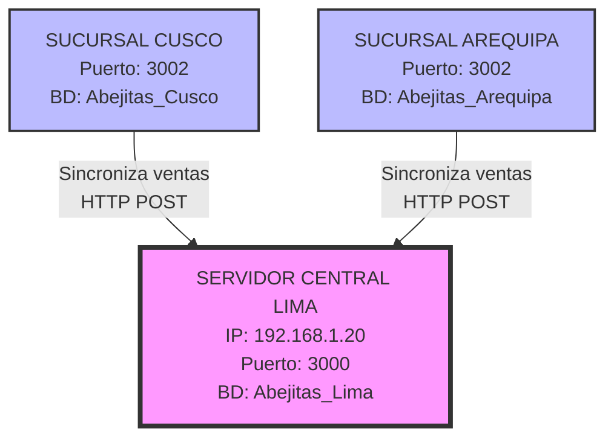
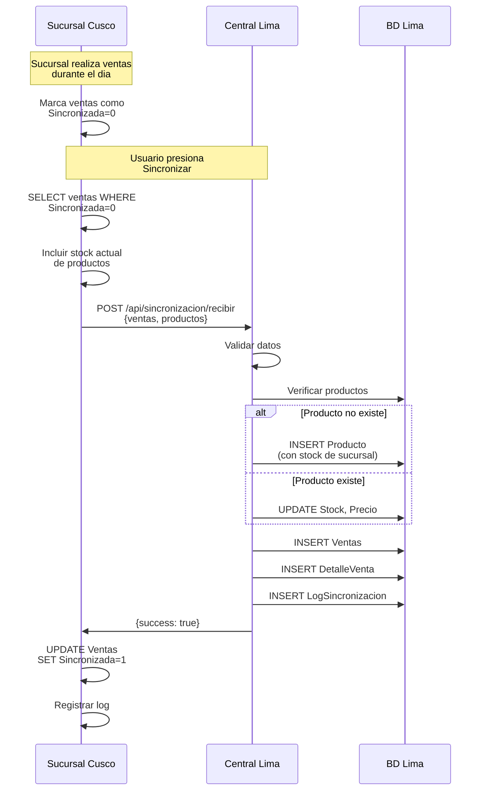
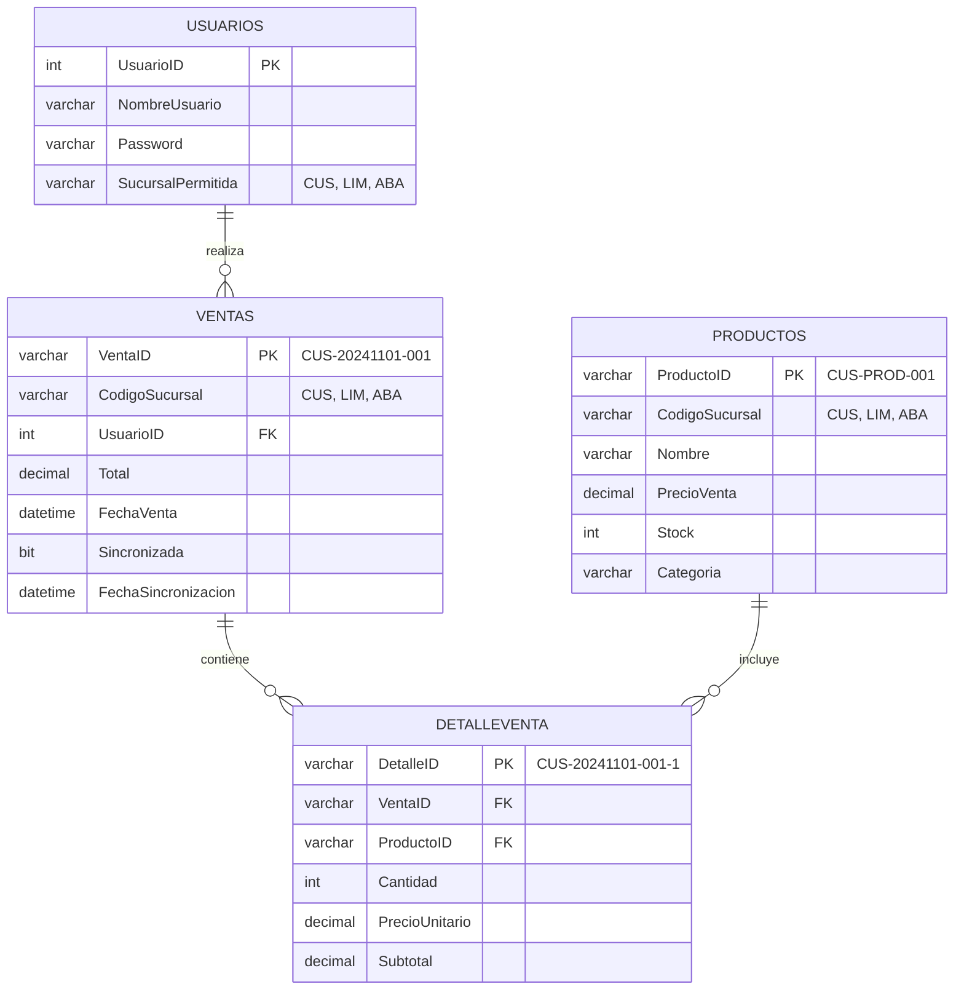
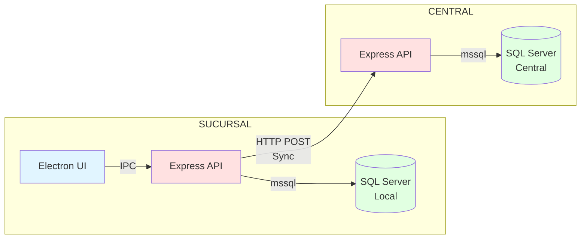

# ABARROTES LAS ABEJITAS - SISTEMA DISTRIBUIDO

Curso: Sistemas Distribuidos

Integrantes:
- Hector
- Lizbeth
- Edwin

Sistema de punto de venta distribuido con sincronización diferida. Cada sucursal opera autónomamente con base de datos local y sincroniza con servidor central.

Implementa: Replicación de datos, consistencia eventual, particionamiento, tolerancia a fallos.

---

## ARQUITECTURA DEL SISTEMA

### Topologia de Red



### Flujo de Sincronizacion



### Modelo de Datos Distribuido



### Arquitectura de Componentes



---

## FUNCIONES CLAVE DE SINCRONIZACION

### 1. executeSync() - Lado Sucursal

Funcion principal que ejecuta sincronizacion desde la sucursal hacia el central.

Ubicacion: `src/backend/controllers/sincronizacionController.js`

```javascript
const executeSync = async (req, res) => {
  // 1. Obtener ventas no sincronizadas del dia
  const ventasResult = await pool.request().query(`
    SELECT v.VentaID, v.FechaVenta, v.Total, v.CodigoSucursal, v.UsuarioID
    FROM Ventas v
    WHERE CAST(v.FechaVenta AS DATE) = CAST(GETDATE() AS DATE)
      AND (v.Sincronizada IS NULL OR v.Sincronizada = 0)
  `);

  // 2. Obtener detalles de cada venta con informacion completa del producto
  for (let venta of ventas) {
    const detallesResult = await pool.request().query(`
      SELECT d.*, p.Nombre, p.Stock, p.PrecioVenta
      FROM DetalleVenta d
      INNER JOIN Productos p ON d.ProductoID = p.ProductoID
      WHERE d.VentaID = @ventaID
    `);
    venta.Detalles = detallesResult.recordset;
  }

  // 3. Enviar datos al servidor central via HTTP
  const centralUrl = `http://${config.servidor_central.host}:${config.servidor_central.puerto}/api/sincronizacion/recibir`;
  const response = await fetch(centralUrl, {
    method: 'POST',
    body: JSON.stringify({ sucursal, nombreSucursal, ventas })
  });

  // 4. Marcar ventas como sincronizadas
  await pool.request().query(`
    UPDATE Ventas
    SET Sincronizada = 1, FechaSincronizacion = GETDATE()
    WHERE VentaID IN (...)
  `);
}
```

**Aspectos clave:**
- Consulta solo ventas del dia pendientes (Sincronizada=0)
- Incluye stock actual de productos para replicacion
- Usa HTTP POST para enviar datos JSON
- Transaccion atomica: marca como sincronizado solo si central confirma

---

### 2. receiveSync() - Lado Central

Funcion que recibe y procesa datos de sincronizacion en el servidor central.

Ubicacion: `src/backend/controllers/sincronizacionController.js`

```javascript
const receiveSync = async (req, res) => {
  const { sucursal, nombreSucursal, ventas } = req.body;

  const transaction = new sql.Transaction(pool);
  await transaction.begin();

  for (const venta of ventas) {
    // 1. Verificar si venta ya existe (idempotencia)
    const existingVenta = await checkRequest.query(
      'SELECT VentaID FROM Ventas WHERE VentaID = @ventaID'
    );
    if (existingVenta.recordset.length > 0) continue;

    // 2. Sincronizar productos (crear o actualizar)
    for (const detalle of venta.Detalles) {
      const existingProducto = await checkProducto.query(
        'SELECT ProductoID FROM Productos WHERE ProductoID = @productoID'
      );

      if (existingProducto.recordset.length === 0) {
        // Producto no existe: crear con stock de sucursal
        await createProducto.query(`
          INSERT INTO Productos (ProductoID, CodigoSucursal, Nombre, PrecioVenta, Stock)
          VALUES (@productoID, @codigoSucursal, @nombre, @precioVenta, @stock)
        `);
      } else {
        // Producto existe: actualizar stock y precio
        await updateProducto.query(`
          UPDATE Productos
          SET Stock = @stock, PrecioVenta = @precioVenta
          WHERE ProductoID = @productoID
        `);
      }
    }

    // 3. Insertar venta
    await ventaRequest.query(`
      INSERT INTO Ventas (VentaID, CodigoSucursal, UsuarioID, Total, FechaVenta, Sincronizada)
      VALUES (@ventaID, @codigoSucursal, @usuarioID, @total, @fechaVenta, 1)
    `);

    // 4. Insertar detalles de venta
    for (const detalle of venta.Detalles) {
      await detalleRequest.query(`
        INSERT INTO DetalleVenta (DetalleID, VentaID, ProductoID, Cantidad, PrecioUnitario, Subtotal)
        VALUES (@detalleID, @ventaID, @productoID, @cantidad, @precioUnitario, @subtotal)
      `);
    }
  }

  await transaction.commit();
}
```

**Aspectos clave:**
- Verifica duplicados usando VentaID (operacion idempotente)
- Sincroniza productos automaticamente (INSERT o UPDATE)
- Actualiza stock del central con stock actual de sucursal
- Usa transacciones SQL para garantizar atomicidad

---

## PRINCIPIOS DE SISTEMAS DISTRIBUIDOS APLICADOS

### 1. Particionamiento de Datos

IDs unicos con prefijo de sucursal evitan colisiones:

```
CUSCO:    CUS-20241101-001, CUS-PROD-001
AREQUIPA: ABA-20241101-001, ABA-PROD-001
LIMA:     LIM-20241101-001, LIM-PROD-001
```

Cada sucursal genera IDs en su propio namespace. No requiere coordinacion central.

### 2. Consistencia Eventual

Durante el dia: Datos inconsistentes entre nodos
Despues de sync: Datos consistentes en servidor central

```
T0: Cusco vende 5 Coca Colas
T1: Arequipa no sabe de la venta
T2: Cusco sincroniza
T3: Lima consolida datos (consistencia lograda)
```

No es consistencia fuerte, pero es aceptable para el dominio del problema.

### 3. Tolerancia a Fallos (CAP Theorem)

Sistema prioriza Availability y Partition Tolerance sobre Consistency:

- DISPONIBILIDAD: Sucursal opera sin conexion a central
- TOLERANCIA A PARTICION: Red puede fallar, sucursales siguen funcionando
- CONSISTENCIA: Eventual, no inmediata

### 4. Replicacion Master-Slave

Sucursales (Masters) generan datos localmente
Central (Slave) replica datos de multiples sucursales

### 5. Idempotencia

Sincronizacion se puede ejecutar multiples veces sin duplicar datos:

```javascript
// Verificacion antes de insertar
const existing = await query('SELECT VentaID WHERE VentaID = @id');
if (existing.length > 0) continue; // Evita duplicados
```

---

## CONFIGURACION DE RED

Ver archivo: `CONFIGURACION_RED.md`

---

## STACK TECNOLOGICO

Backend: Node.js, Express, mssql
Frontend: Electron, HTML/CSS/JavaScript
Base de datos: SQL Server 2014+
Sincronizacion: HTTP REST, JSON

---

## INSTALACION RAPIDA

1. Instalar dependencias: `npm install`
2. Configurar SQL Server (ejecutar scripts en `database/`)
3. Configurar `config/config.json` segun sucursal
4. Arrancar: `npm start` (sucursales) o `node src/backend/server.js` (central)


---

## CONCEPTOS CLAVE

**Autonomia Local:** Cada nodo opera independientemente sin servidor central
**Particionamiento:** Datos separados por prefijo (CUS-, ABA-, LIM-)
**Consistencia Eventual:** Sincronizacion diferida, no en tiempo real
**Idempotencia:** Operaciones repetibles sin efectos secundarios
**Tolerancia a Fallos:** Sistema funciona con red caida
