# ABARROTES LAS ABEJITAS - SISTEMA DISTRIBUIDO

**Curso:** Sistemas Distribuidos

**Integrantes:**
- Hector
- Lizbeth
- Edwin

---

## INTRODUCCIÓN

En el contexto actual del comercio minorista, las empresas con múltiples sucursales enfrentan el desafío de mantener operaciones continuas incluso cuando la conectividad de red es intermitente o inexistente. Este proyecto implementa un **sistema de punto de venta distribuido** diseñado para operar autónomamente en cada sucursal, garantizando disponibilidad y tolerancia a fallos.

El sistema está fundamentado en principios de **sistemas distribuidos**, aplicando conceptos como:

- **Consistencia Eventual:** Las sucursales operan independientemente y sincronizan datos de forma diferida
- **Particionamiento de Datos:** Cada nodo mantiene su propia base de datos local
- **Tolerancia a Fallos:** Las operaciones continúan sin depender del servidor central
- **Replicación de Datos:** Los datos se replican desde sucursales hacia el servidor central

**Caso de Uso:** Una cadena de abarrotes con sucursales en Lima, Cusco y Abancay donde cada tienda debe:
1. Registrar ventas sin depender de conectividad con otras sucursales
2. Sincronizar datos al final del día cuando hay conexión
3. Consolidar información en un servidor central para reportes globales

Este enfoque arquitectónico permite **disponibilidad continua** a costa de **consistencia inmediata**, siguiendo el teorema CAP (Consistency, Availability, Partition Tolerance).

---

## ARQUITECTURA DEL SISTEMA

### Topologia de Red

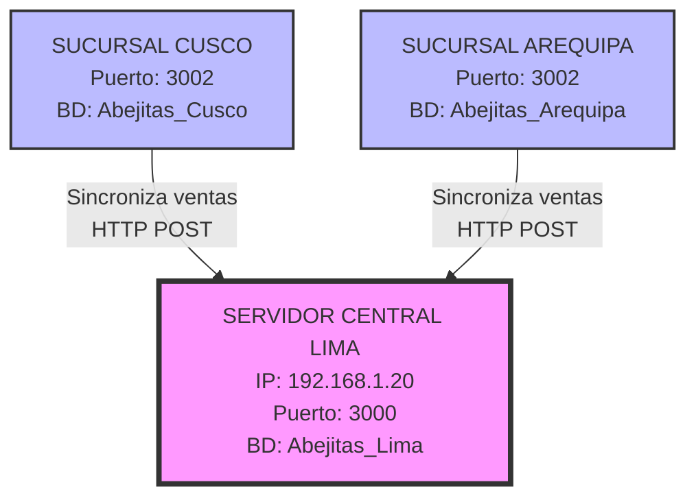

### Flujo de Sincronizacion

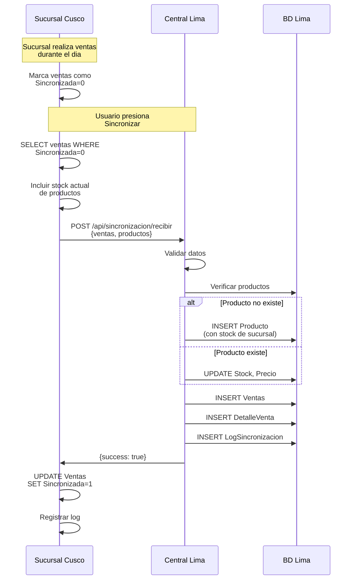

### Modelo de Datos Distribuido

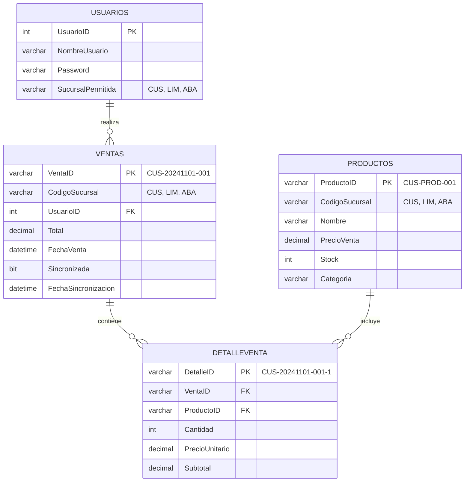

### Arquitectura de Componentes

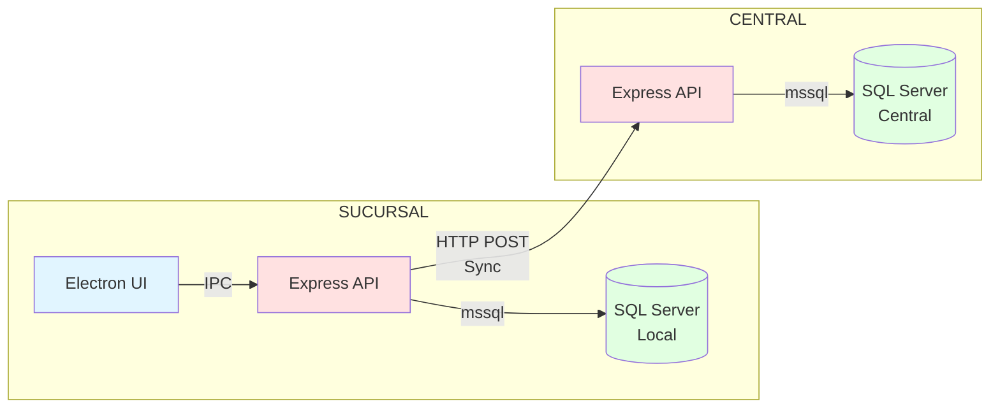

---

## ARQUITECTURA EN CAPAS Y PROTOCOLOS

El sistema implementa una **arquitectura Cliente-Servidor** distribuida, donde cada sucursal actúa como cliente que se sincroniza con un servidor central. A continuación se detalla la estructura en capas y los protocolos utilizados:

### Modelo de Capas Implementado

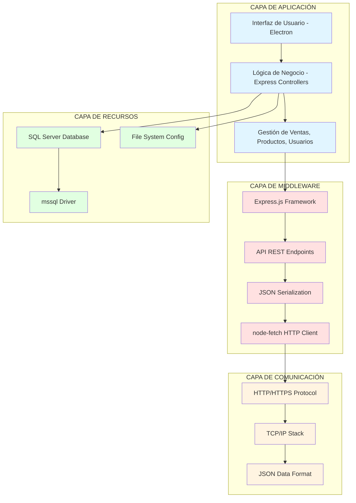

### Descripción de Capas

| Capa | Función Principal | Componentes Utilizados |
|------|------------------|------------------------|
| **Aplicación** | Gestiona lógica de negocio e interfaz de usuario | Electron (UI), Express Controllers, Módulos de negocio |
| **Middleware** | Coordina comunicación entre sucursales y servidor central | Express.js, REST API, JSON, node-fetch |
| **Comunicación** | Transporta mensajes entre nodos distribuidos | HTTP, TCP/IP, JSON |
| **Recursos** | Administra datos y configuración del sistema | SQL Server, mssql driver, archivos de configuración |

### Protocolos de Comunicación Utilizados

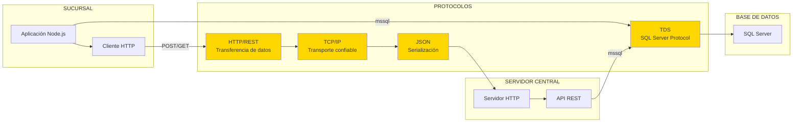

### Protocolos Implementados en el Sistema

#### 1. HTTP/REST - Transferencia de Datos entre Nodos

**Función:** Protocolo de aplicación para intercambio de datos entre sucursales y servidor central.

**Implementación:**
```javascript
// Sucursal envía datos al servidor central
const centralUrl = `http://${config.servidor_central.host}:${config.servidor_central.puerto}/api/sincronizacion/recibir`;
const response = await fetch(centralUrl, {
  method: 'POST',
  headers: { 'Content-Type': 'application/json' },
  body: JSON.stringify({ sucursal, ventas, productos })
});
```

**Características:**
- Arquitectura RESTful (GET, POST)
- Comunicación sin estado (stateless)
- Formato JSON para intercambio de datos
- Endpoints específicos: `/api/sincronizacion/recibir`, `/api/sincronizacion/ejecutar`

#### 2. TCP/IP - Capa de Transporte

**Función:** Protocolo base para transmisión confiable de datos en red.

**Características:**
- Garantiza entrega ordenada de paquetes
- Control de flujo y congestión
- Manejo de reconocimientos (ACK)
- Puerto por defecto: 3000 (configurable)

#### 3. JSON - Formato de Serialización

**Función:** Formato estándar para estructurar datos transmitidos entre nodos.

**Ejemplo de mensaje de sincronización:**
```json
{
  "sucursal": "CUS",
  "nombreSucursal": "Cusco",
  "ventas": [
    {
      "VentaID": "CUS-20241109-001",
      "Total": 125.50,
      "FechaVenta": "2024-11-09T14:30:00",
      "Detalles": [
        {
          "ProductoID": "CUS-PROD-001",
          "Cantidad": 2,
          "PrecioUnitario": 5.50,
          "Stock": 98
        }
      ]
    }
  ]
}
```

#### 4. TDS (Tabular Data Stream) - Protocolo SQL Server

**Función:** Protocolo nativo de SQL Server para comunicación cliente-servidor con la base de datos.

**Implementación:**
```javascript
const sql = require('mssql');
const config = {
  server: 'HECTOR',
  database: 'Abejitas_Cusco',
  user: 'sa',
  password: '12345678',
  port: 1433,
  options: {
    encrypt: false,
    trustServerCertificate: true
  }
};
await sql.connect(config);
```

### Patrón de Comunicación Cliente-Servidor

El sistema implementa un **patrón Cliente-Servidor distribuido**:

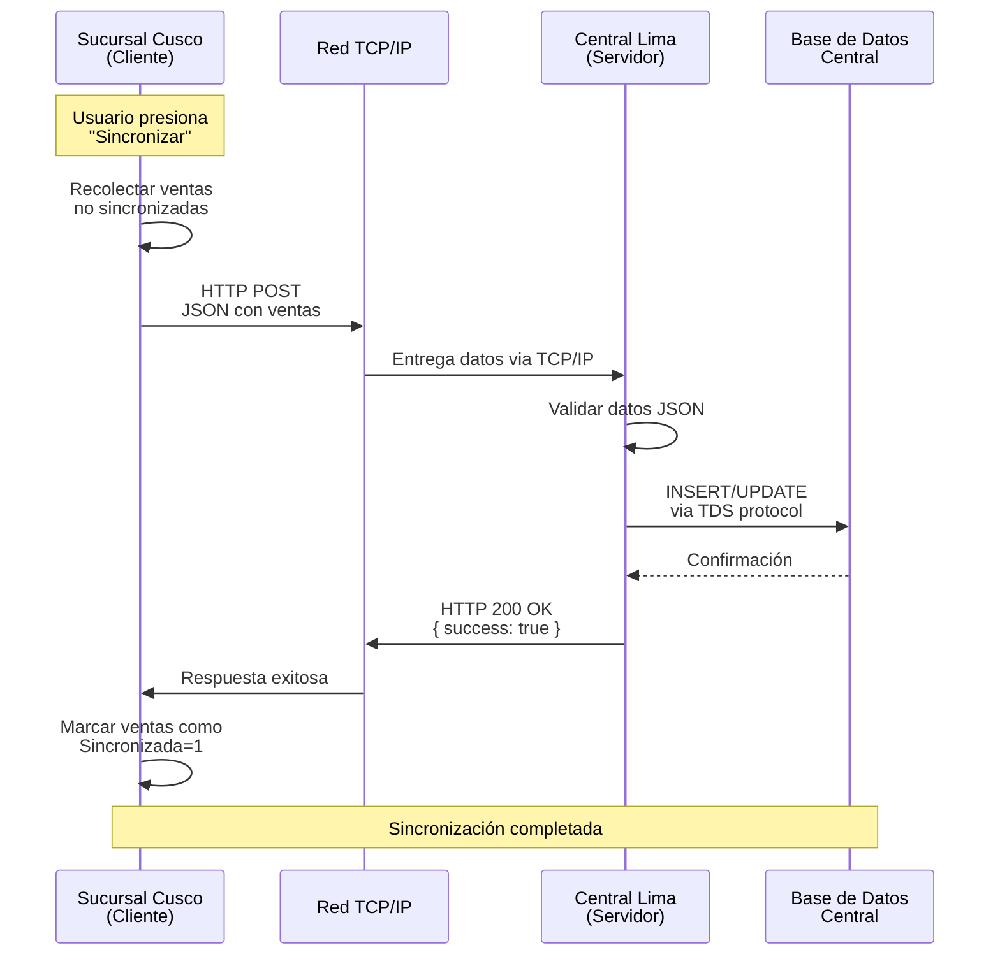

**Características del patrón:**

- **Cliente (Sucursales):** Inician solicitudes de sincronización
- **Servidor (Central):** Escucha peticiones en puerto 3000, procesa y almacena datos
- **Comunicación Asíncrona:** Las sucursales no esperan respuesta inmediata
- **Desacoplamiento:** Sucursales operan independientemente del servidor

### Librerías que Hacen Posible la Sincronización

| Librería | Versión | Función en el Sistema |
|----------|---------|----------------------|
| **express** | ^4.18.2 | Framework para API REST del servidor central y sucursales |
| **node-fetch** | ^2.7.0 | Cliente HTTP para enviar datos desde sucursales al central |
| **mssql** | ^10.0.1 | Driver para conectar Node.js con SQL Server (protocolo TDS) |
| **cors** | ^2.8.5 | Middleware para permitir peticiones cross-origin entre sucursales y central |
| **node-cron** | ^3.0.3 | Planificador para sincronización automática nocturna |
| **jsonwebtoken** | ^9.0.2 | Autenticación y autorización de usuarios (seguridad) |

**Diagrama de dependencias:**

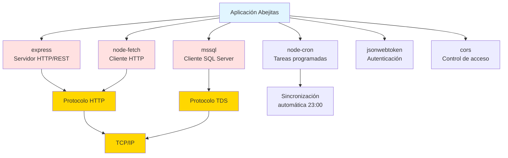

---

## FUNCIONES CLAVE DE SINCRONIZACION

### 1. executeSync() - Lado Sucursal

Funcion principal que ejecuta sincronizacion desde la sucursal hacia el central.

Ubicacion: `src/backend/controllers/sincronizacionController.js`

```javascript
const executeSync = async (req, res) => {
  // 1. Obtener ventas no sincronizadas del dia
  const ventasResult = await pool.request().query(`
    SELECT v.VentaID, v.FechaVenta, v.Total, v.CodigoSucursal, v.UsuarioID
    FROM Ventas v
    WHERE CAST(v.FechaVenta AS DATE) = CAST(GETDATE() AS DATE)
      AND (v.Sincronizada IS NULL OR v.Sincronizada = 0)
  `);

  // 2. Obtener detalles de cada venta con informacion completa del producto
  for (let venta of ventas) {
    const detallesResult = await pool.request().query(`
      SELECT d.*, p.Nombre, p.Stock, p.PrecioVenta
      FROM DetalleVenta d
      INNER JOIN Productos p ON d.ProductoID = p.ProductoID
      WHERE d.VentaID = @ventaID
    `);
    venta.Detalles = detallesResult.recordset;
  }

  // 3. Enviar datos al servidor central via HTTP
  const centralUrl = `http://${config.servidor_central.host}:${config.servidor_central.puerto}/api/sincronizacion/recibir`;
  const response = await fetch(centralUrl, {
    method: 'POST',
    body: JSON.stringify({ sucursal, nombreSucursal, ventas })
  });

  // 4. Marcar ventas como sincronizadas
  await pool.request().query(`
    UPDATE Ventas
    SET Sincronizada = 1, FechaSincronizacion = GETDATE()
    WHERE VentaID IN (...)
  `);
}
```

**Aspectos clave:**
- Consulta solo ventas del dia pendientes (Sincronizada=0)
- Incluye stock actual de productos para replicacion
- Usa HTTP POST para enviar datos JSON
- Transaccion atomica: marca como sincronizado solo si central confirma

---

### 2. receiveSync() - Lado Central

Funcion que recibe y procesa datos de sincronizacion en el servidor central.

Ubicacion: `src/backend/controllers/sincronizacionController.js`

```javascript
const receiveSync = async (req, res) => {
  const { sucursal, nombreSucursal, ventas } = req.body;

  const transaction = new sql.Transaction(pool);
  await transaction.begin();

  for (const venta of ventas) {
    // 1. Verificar si venta ya existe (idempotencia)
    const existingVenta = await checkRequest.query(
      'SELECT VentaID FROM Ventas WHERE VentaID = @ventaID'
    );
    if (existingVenta.recordset.length > 0) continue;

    // 2. Sincronizar productos (crear o actualizar)
    for (const detalle of venta.Detalles) {
      const existingProducto = await checkProducto.query(
        'SELECT ProductoID FROM Productos WHERE ProductoID = @productoID'
      );

      if (existingProducto.recordset.length === 0) {
        // Producto no existe: crear con stock de sucursal
        await createProducto.query(`
          INSERT INTO Productos (ProductoID, CodigoSucursal, Nombre, PrecioVenta, Stock)
          VALUES (@productoID, @codigoSucursal, @nombre, @precioVenta, @stock)
        `);
      } else {
        // Producto existe: actualizar stock y precio
        await updateProducto.query(`
          UPDATE Productos
          SET Stock = @stock, PrecioVenta = @precioVenta
          WHERE ProductoID = @productoID
        `);
      }
    }

    // 3. Insertar venta
    await ventaRequest.query(`
      INSERT INTO Ventas (VentaID, CodigoSucursal, UsuarioID, Total, FechaVenta, Sincronizada)
      VALUES (@ventaID, @codigoSucursal, @usuarioID, @total, @fechaVenta, 1)
    `);

    // 4. Insertar detalles de venta
    for (const detalle of venta.Detalles) {
      await detalleRequest.query(`
        INSERT INTO DetalleVenta (DetalleID, VentaID, ProductoID, Cantidad, PrecioUnitario, Subtotal)
        VALUES (@detalleID, @ventaID, @productoID, @cantidad, @precioUnitario, @subtotal)
      `);
    }
  }

  await transaction.commit();
}
```

**Aspectos clave:**
- Verifica duplicados usando VentaID (operacion idempotente)
- Sincroniza productos automaticamente (INSERT o UPDATE)
- Actualiza stock del central con stock actual de sucursal
- Usa transacciones SQL para garantizar atomicidad

---

## PRINCIPIOS DE SISTEMAS DISTRIBUIDOS APLICADOS

### 1. Particionamiento de Datos

IDs unicos con prefijo de sucursal evitan colisiones:

```
CUSCO:    CUS-20241101-001, CUS-PROD-001
AREQUIPA: ABA-20241101-001, ABA-PROD-001
LIMA:     LIM-20241101-001, LIM-PROD-001
```

Cada sucursal genera IDs en su propio namespace. No requiere coordinacion central.

### 2. Consistencia Eventual

Durante el dia: Datos inconsistentes entre nodos
Despues de sync: Datos consistentes en servidor central

```
T0: Cusco vende 5 Coca Colas
T1: Arequipa no sabe de la venta
T2: Cusco sincroniza
T3: Lima consolida datos (consistencia lograda)
```

No es consistencia fuerte, pero es aceptable para el dominio del problema.

### 3. Tolerancia a Fallos (CAP Theorem)

Sistema prioriza Availability y Partition Tolerance sobre Consistency:

- DISPONIBILIDAD: Sucursal opera sin conexion a central
- TOLERANCIA A PARTICION: Red puede fallar, sucursales siguen funcionando
- CONSISTENCIA: Eventual, no inmediata

### 4. Replicacion Master-Slave

Sucursales (Masters) generan datos localmente
Central (Slave) replica datos de multiples sucursales

### 5. Idempotencia

Sincronizacion se puede ejecutar multiples veces sin duplicar datos:

```javascript
// Verificacion antes de insertar
const existing = await query('SELECT VentaID WHERE VentaID = @id');
if (existing.length > 0) continue; // Evita duplicados
```

---

## CONFIGURACION DE RED

Ver archivo: `CONFIGURACION_RED.md`

---

## STACK TECNOLOGICO

Backend: Node.js, Express, mssql
Frontend: Electron, HTML/CSS/JavaScript
Base de datos: SQL Server 2014+
Sincronizacion: HTTP REST, JSON

---

## INSTALACION RAPIDA

1. Instalar dependencias: `npm install`
2. Configurar SQL Server (ejecutar scripts en `database/`)
3. Configurar `config/config.json` segun sucursal
4. Arrancar: `npm start` (sucursales) o `node src/backend/server.js` (central)


---

## CONCEPTOS CLAVE

**Autonomia Local:** Cada nodo opera independientemente sin servidor central
**Particionamiento:** Datos separados por prefijo (CUS-, ABA-, LIM-)
**Consistencia Eventual:** Sincronizacion diferida, no en tiempo real
**Idempotencia:** Operaciones repetibles sin efectos secundarios
**Tolerancia a Fallos:** Sistema funciona con red caida

---

## RECOMENDACIONES DE ESCALABILIDAD

A medida que el sistema crece (más sucursales, mayor volumen de transacciones), se recomiendan las siguientes mejoras:

### 1. Escalabilidad Horizontal

**Problema actual:** Un solo servidor central puede saturarse con 10+ sucursales sincronizando simultáneamente.

**Solución:**
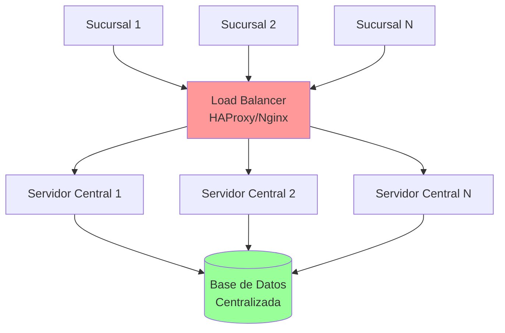

**Implementación:**
- Agregar balanceador de carga (HAProxy, Nginx)
- Múltiples instancias del servidor central
- Base de datos única o con replicación maestro-esclavo

### 2. Optimización de Sincronización

**Problema actual:** Sincroniza todas las ventas del día en cada ejecución.

**Mejoras propuestas:**

#### a) Sincronización Incremental
```javascript
// Solo enviar ventas nuevas desde última sincronización
SELECT v.* FROM Ventas v
WHERE v.FechaSincronizacion IS NULL
  OR v.FechaSincronizacion > @ultimaSincronizacion
```

#### b) Compresión de Datos
```javascript
const zlib = require('zlib');
const compressedData = zlib.gzipSync(JSON.stringify(ventas));
// Reduce ancho de banda hasta 70%
```

#### c) Sincronización por Lotes (Batch)
```javascript
// Enviar ventas en grupos de 100 en vez de todas juntas
for (let i = 0; i < ventas.length; i += 100) {
  const batch = ventas.slice(i, i + 100);
  await enviarBatch(batch);
}
```

### 3. Mejora de Tolerancia a Fallos

**Problema actual:** Si la sincronización falla a medias, puede quedar inconsistente.

**Solución: Cola de Mensajes (Message Queue)**

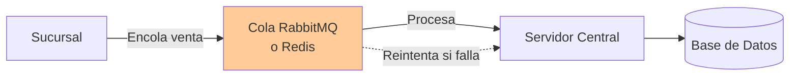

**Ventajas:**
- Reintentos automáticos si falla la sincronización
- No se pierden datos aunque el servidor esté caído
- Procesamiento asíncrono sin bloquear la sucursal

**Tecnologías:**
- RabbitMQ
- Redis Pub/Sub
- Apache Kafka (para alto volumen)

### 4. Caché Distribuido

**Problema:** Consultas repetitivas a base de datos central (ej: catálogo de productos).

**Solución:**
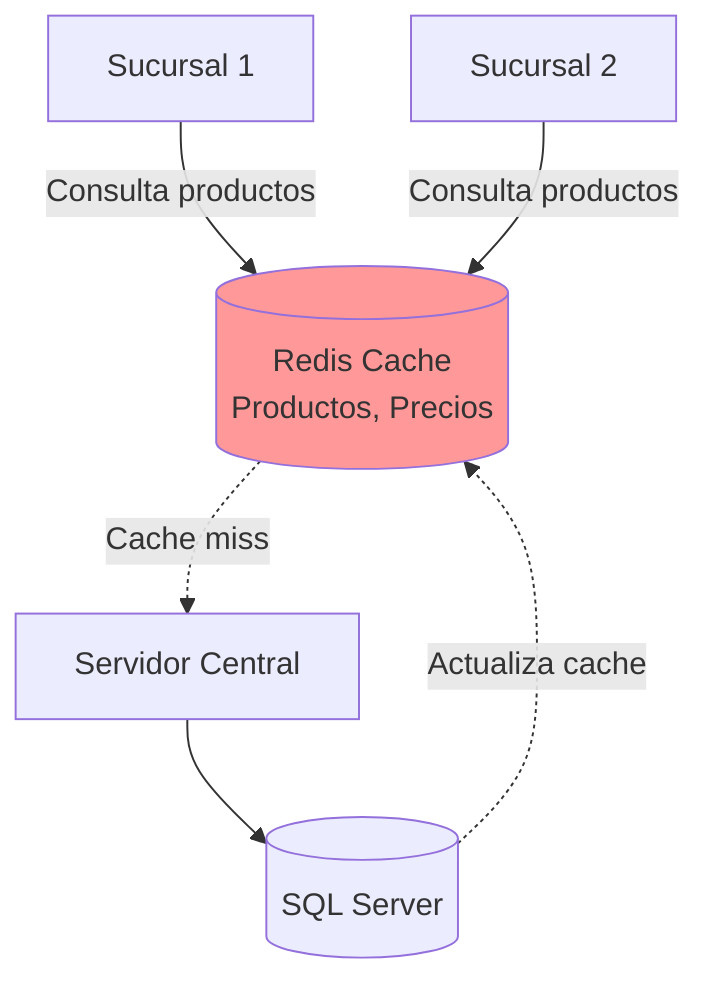

**Implementación:**
```javascript
const redis = require('redis');
const client = redis.createClient();

// Cachear productos por 1 hora
async function obtenerProductos() {
  const cached = await client.get('productos');
  if (cached) return JSON.parse(cached);

  const productos = await db.query('SELECT * FROM Productos');
  await client.setex('productos', 3600, JSON.stringify(productos));
  return productos;
}
```

### 5. Monitoreo y Observabilidad

**Implementar:**

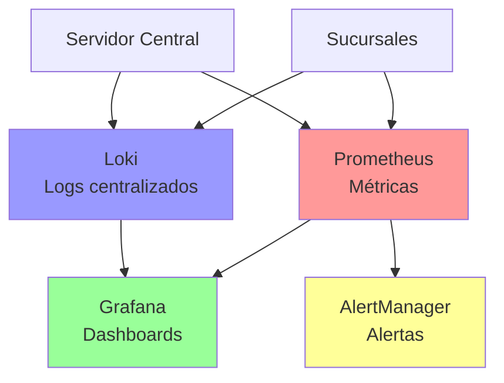

**Métricas clave a monitorear:**
- Latencia de sincronización por sucursal
- Tasa de errores HTTP
- Número de ventas sincronizadas/hora
- Uso de CPU/Memoria en servidores
- Tiempo de respuesta de base de datos

### 6. Seguridad Mejorada

**Implementaciones recomendadas:**

| Mejora | Tecnología | Beneficio |
|--------|-----------|-----------|
| HTTPS/TLS | Let's Encrypt, SSL Certificates | Encriptación de datos en tránsito |
| VPN | WireGuard, OpenVPN | Túnel seguro entre sucursales y central |
| API Keys | JWT con rotación | Autenticación fuerte de sucursales |
| Rate Limiting | Express-rate-limit | Prevenir ataques DoS |
| Firewall | iptables, Cloud Firewall | Filtrado de IPs autorizadas |

### 7. Base de Datos Distribuida

**Para 50+ sucursales:**

Considerar migrar a una base de datos distribuida:

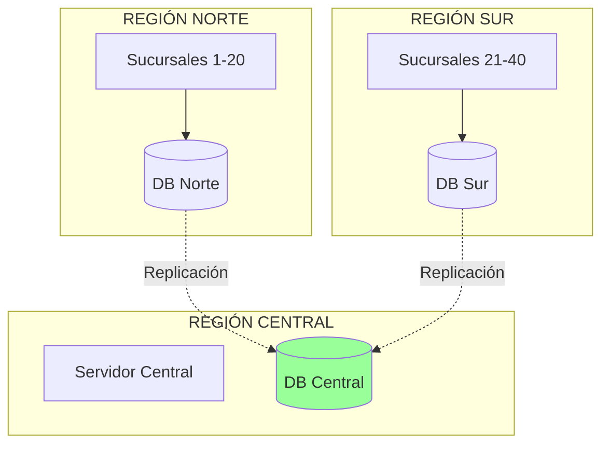

**Opciones:**
- **MongoDB con Sharding:** Particionar datos por región geográfica
- **CockroachDB:** Base de datos distribuida con consistencia fuerte
- **PostgreSQL con Citus:** Extensión para distribución horizontal

### Tabla Comparativa de Escalabilidad

| Métrica | Sistema Actual | Con Mejoras Propuestas |
|---------|---------------|----------------------|
| **Sucursales soportadas** | 5-10 | 100+ |
| **Transacciones/seg** | ~50 | ~5,000 |
| **Tiempo sincronización** | 5-10 segundos | 1-2 segundos |
| **Tolerancia a fallos** | Baja (reintentos manuales) | Alta (cola de mensajes) |
| **Ancho de banda** | Alto (JSON sin comprimir) | Bajo (compresión gzip) |
| **Costo infraestructura** | 1 servidor | 3-5 servidores + cache |

---

## CONCLUSIÓN

Este proyecto demuestra la implementación práctica de un **sistema distribuido real** aplicando principios fundamentales de la teoría de sistemas distribuidos:

### Logros Técnicos

1. **Arquitectura Cliente-Servidor Distribuida:** Implementación exitosa de un patrón donde múltiples clientes (sucursales) se comunican con un servidor central usando protocolos estándar (HTTP/REST, TCP/IP, JSON).

2. **Protocolos de Comunicación:** Uso eficiente de protocolos de capa de aplicación (HTTP/REST), transporte (TCP/IP), y presentación (JSON) para garantizar interoperabilidad entre nodos heterogéneos.

3. **Consistencia Eventual:** Aplicación del modelo de consistencia eventual que prioriza disponibilidad sobre consistencia inmediata, apropiado para el dominio del problema (punto de venta).

4. **Tolerancia a Particiones de Red:** El sistema continúa operando incluso cuando las sucursales pierden conexión con el servidor central, garantizando disponibilidad del servicio.

5. **Replicación de Datos:** Implementación de replicación master-slave donde cada sucursal (master local) replica sus datos al servidor central (consolidador).

### Lecciones Aprendidas

**Teorema CAP en la Práctica:**
- El sistema sacrifica **Consistencia** inmediata a favor de **Disponibilidad** y **Tolerancia a Particiones**
- Esta decisión arquitectónica es apropiada para el caso de uso (ventas en tienda física)
- En sistemas financieros o críticos, se requeriría consistencia fuerte (ej: usando Paxos o Raft)

**Coordinación sin Servidor:**
- El uso de IDs con prefijo de sucursal (CUS-, LIM-, ABA-) elimina la necesidad de coordinación centralizada
- Técnica de **particionamiento** que evita conflictos y mejora la autonomía local

**Operaciones Idempotentes:**
- La verificación de duplicados usando VentaID permite reintentos seguros
- Fundamental para sistemas distribuidos donde pueden ocurrir fallos parciales

### Aplicabilidad en el Mundo Real

Este sistema es aplicable a:
- ✅ Cadenas de retail con múltiples tiendas
- ✅ Franquicias que operan semi-autónomamente
- ✅ Negocios en zonas con conectividad inestable
- ✅ Escenarios edge computing (procesamiento local + sincronización diferida)

### Importancia de los Protocolos

Los **protocolos de comunicación** (HTTP/REST, TCP/IP, JSON, TDS) son la infraestructura esencial que permite que computadores separados actúen como una entidad coordinada. Sin protocolos estandarizados, los sistemas distribuidos modernos serían imposibles.

- **HTTP/REST:** Permite comunicación sin estado entre nodos heterogéneos
- **TCP/IP:** Garantiza entrega confiable de datos a través de redes no confiables
- **JSON:** Proporciona serialización portable entre diferentes plataformas
- **TDS:** Habilita comunicación eficiente con bases de datos SQL Server

### Trabajo Futuro

Para llevar este sistema a producción empresarial, se recomienda:

1. Implementar las mejoras de escalabilidad propuestas (sección anterior)
2. Agregar monitoreo y alertas con Prometheus/Grafana
3. Implementar HTTPS y VPN para seguridad en producción
4. Desarrollar pruebas de carga y estrés (Apache JMeter, k6)
5. Crear plan de recuperación ante desastres (backup, replicación)

### Reflexión Final

Este proyecto demuestra que **los sistemas distribuidos no son solo teoría académica**, sino soluciones prácticas a problemas reales de negocio. La capacidad de una tienda de seguir operando sin conexión al servidor central mientras mantiene consistencia eventual es un ejemplo perfecto del balance entre **disponibilidad, consistencia y tolerancia a fallos** que caracteriza el diseño de sistemas distribuidos modernos.

Los conceptos aplicados aquí (particionamiento, replicación, consistencia eventual, protocolos de comunicación) son los mismos que utilizan sistemas a escala masiva como Amazon DynamoDB, Google Spanner, y Apache Cassandra, adaptados a la escala y requisitos de un negocio de abarrotes.


